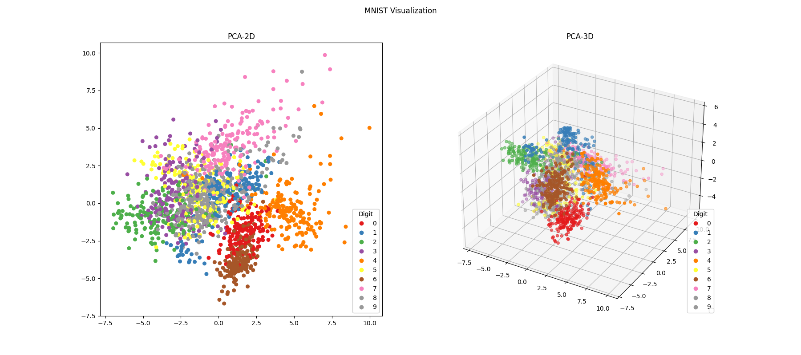

# Machine-learning
## Introduction
Here is my python source code about implementing machine learning algorithms including supervised learning and unsupervised learning. I also used several kaggle datasets like tranditional datasets and time series datasets to practice with machine learning algorithms. I used to some basic techniques for data science including : Data visualization, data cleaning, data preprocessing, way to choose best parameters as well as best model for data.

#### Real data
I got a real dataset which was very dirty data. I cleaned this data and preprocess after that choosing appropriate machine learning models to predict the career level for each candidate.

  

#### PCA
I learned and used PCA algorithms to reduce and visualization MNIST dataset.

  

#### Logistic regression
I learned and implemented logistic algorithm.

  

#### Gradient descent
I learned and implemented gradient descent algorithm.

  

#### Perceptron
I learned and implemented perceptron algorithm.

  

#### Multi layers perceptron
I learned and implemented multi layers perceptron algorithm.

  

#### Softmax
I learned and implemented softmax algorithm.

  

#### Suport vector machine 
I learned and implemented svm algorithm.

  

