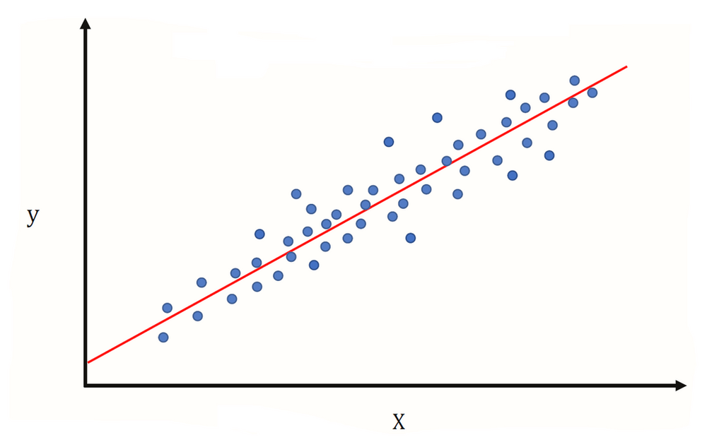

# Machine-learning
## Introduction
Here is my python source code about implementing machine learning algorithms about supervised learning and unsupervised learning. I also used several kaggle datasets to practice with machine learning algorithms. I used to some basic techniques for data science including : Data visualization, Data pipeline, Data preprocess, Way to choose best parameters as well as best model for data.

#### Linear regression

  

#### Logistic regression

  

#### K-means clustering

  

#### Gradient descent

  

#### Perceptron

  

#### Multi layers perceptron

  

#### Softmax regression

  

#### Suport vector machine 

  

