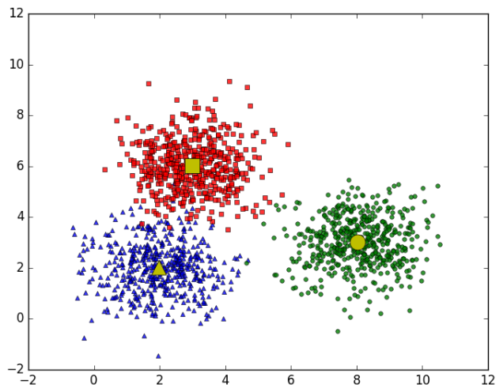
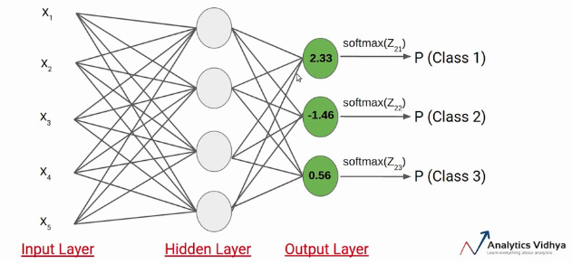

# Machine-learning
## Introduction
Here is my python source code about implementing machine learning algorithms including supervised learning and unsupervised learning. I also used several kaggle datasets to practice with machine learning algorithms. I used to some basic techniques for data science including : Data visualization, data cleaning, data preprocessing, way to choose best parameters as well as best model for data.

#### Real data
I got a real dataset which was very dirty data. I cleaned this data and preprocess after that choosing appropriate machine learning models.

  

#### Logistic regression
I learned and implementing logistic algorithm.

  

#### K-means clustering
I learned and implementing K-mean algorithm.

  

#### Gradient descent
I learned and implementing gradient descent algorithm.

  

#### Perceptron
I learned and implementing perceptron algorithm.

  

#### Multi layers perceptron
I learned and implementing multi layers perceptron algorithm.

  

#### Softmax
I learned and implementing softmax algorithm.

  

#### Suport vector machine 
I learned and implementing svm algorithm.

  

